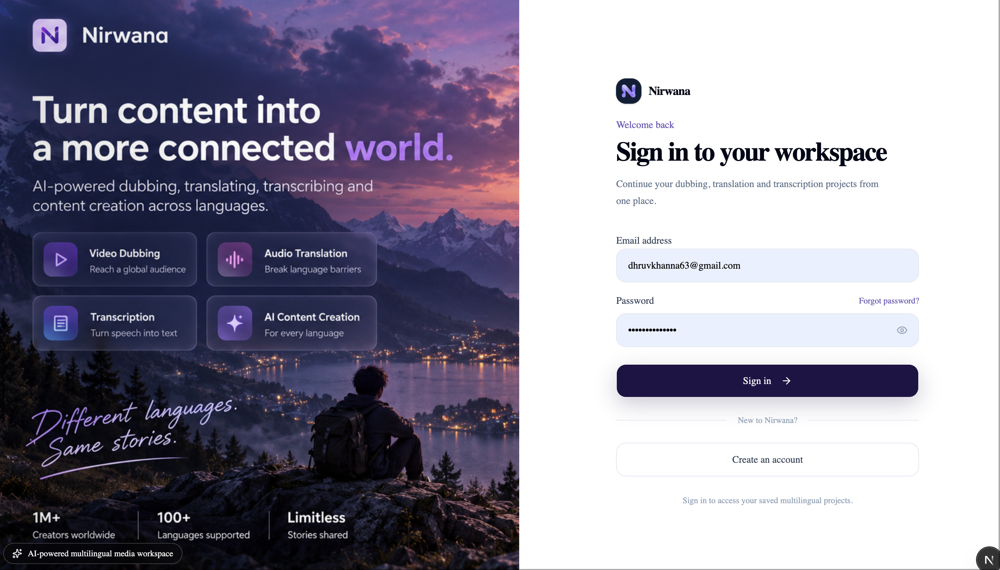
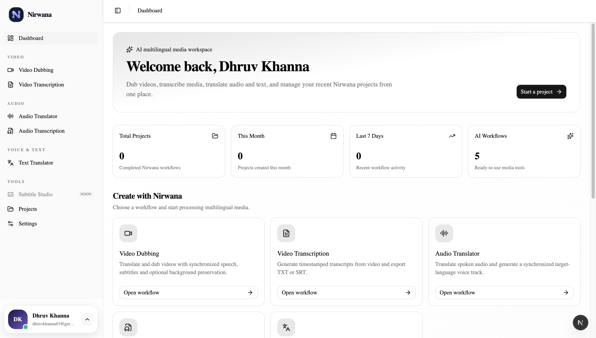
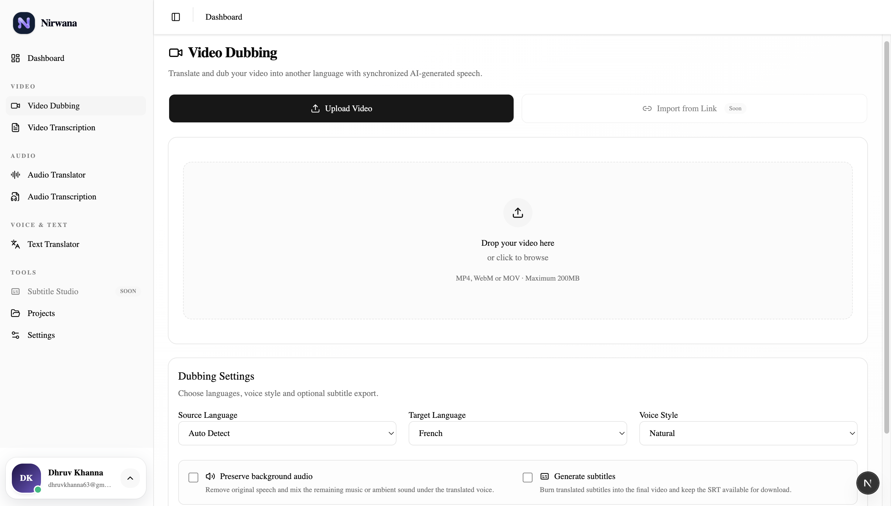
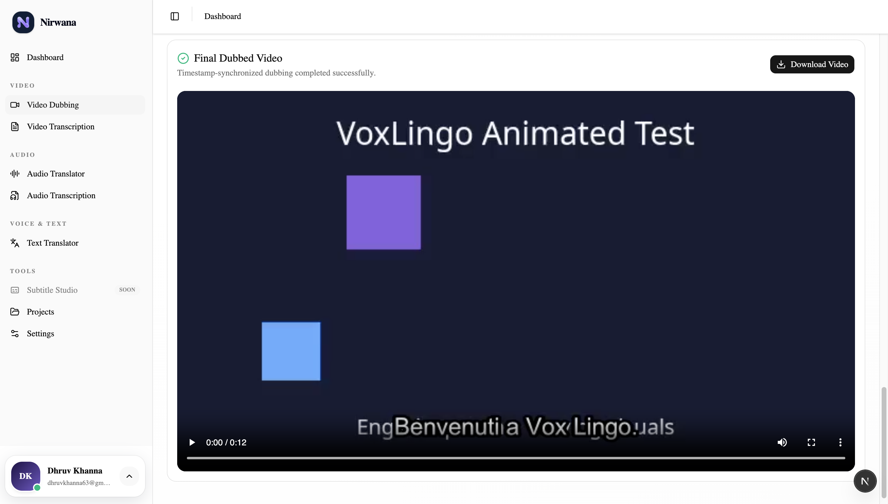
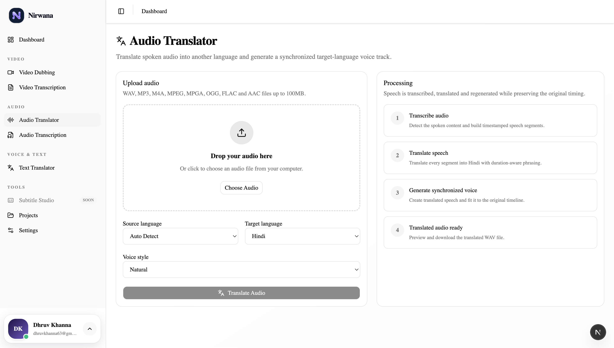
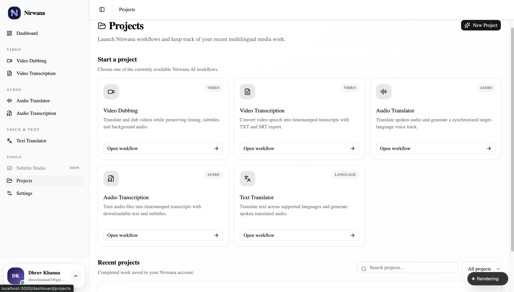
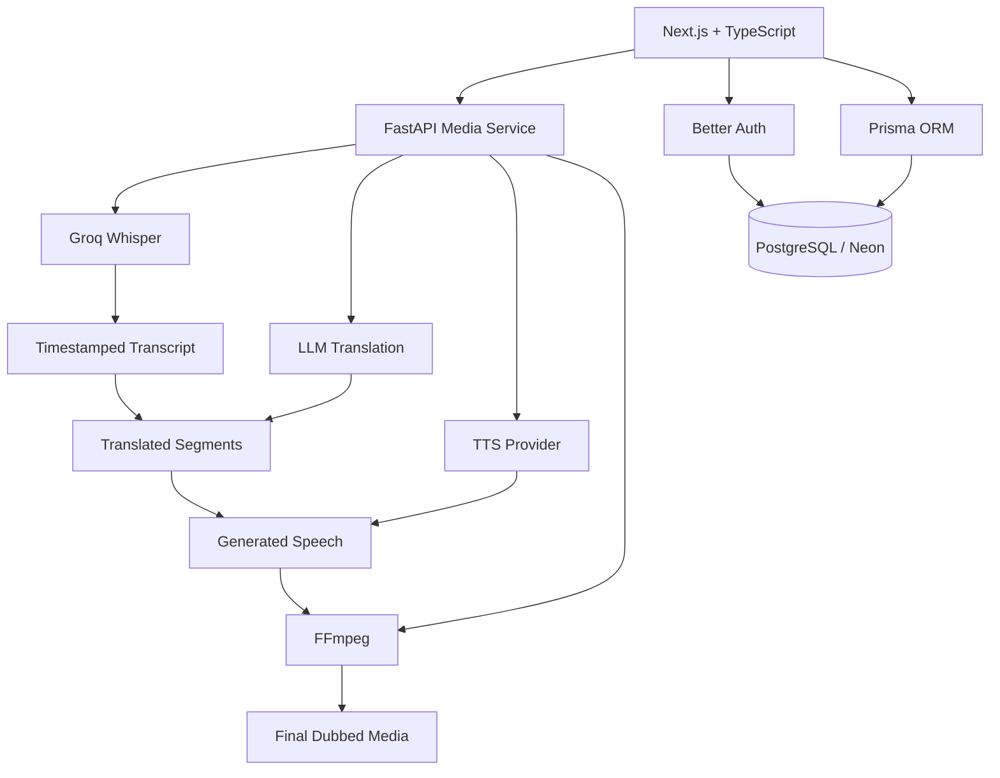

# Nirwana

<p align="center">
  <strong>AI-powered multilingual media workspace</strong>
</p>

<p align="center">
  Translate, transcribe, dub, and generate multilingual media from one full-stack AI workspace.
</p>

<p align="center">
  
  
  
  
  
  
</p>

---

## Preview

### Landing Page



### Dashboard



### AI Video Dubbing



### Final Dubbed Output



### Audio Translation



### Projects



---

## Overview

Nirwana is a full-stack AI application for translating, transcribing, and dubbing media across languages. It combines speech recognition, LLM-powered translation, multilingual text-to-speech, subtitle generation, timestamp-aware dubbing, and video rendering into one workspace.

The project is designed as an end-to-end AI product rather than a single API integration.

### Core workflows

- AI Video Dubbing
- Video Transcription
- Audio Transcription
- Audio Translation
- Text Translation + Speech
- Subtitle Generation
- User Authentication
- Project History
- 25-language support

---

## Key Features

### AI Video Dubbing

Upload a video and generate a translated dubbed version with:

- AI speech transcription
- word/timestamp-aware segmentation
- duration-aware translation
- multilingual speech generation
- synchronized dubbing
- subtitle generation
- optional background audio preservation
- final MP4 rendering

### Video & Audio Transcription

Generate readable timestamped transcripts from uploaded media using AI speech recognition.

### Audio Translation

Translate spoken audio and regenerate speech while preserving the source timeline as closely as possible.

### Text Translator

Translate text between supported languages and generate spoken output from the translated result.

### Multilingual Support

Nirwana currently exposes 25 languages through a shared language registry:

`English` · `Hindi` · `Spanish` · `French` · `German` · `Portuguese` · `Italian` · `Japanese` · `Chinese` · `Korean` · `Arabic` · `Russian` · `Dutch` · `Turkish` · `Filipino` · `Polish` · `Indonesian` · `Swedish` · `Romanian` · `Czech` · `Greek` · `Finnish` · `Tamil` · `Ukrainian` · `Malay`

### Authentication & Project History

Users can sign up, sign in, and access a personal workspace. Project metadata is associated with authenticated users through PostgreSQL.

---

## Architecture



---

## Video Dubbing Pipeline

```text
Uploaded Video
      ↓
Audio Extraction
      ↓
Speech Transcription
      ↓
Smart Timestamp Segmentation
      ↓
Duration-Aware Translation
      ↓
Speech Generation
      ↓
Timing Synchronization
      ↓
Background Audio Preservation
      ↓
Subtitle Burn-In
      ↓
Final Rendered Video
```

---

## Tech Stack

| Layer | Technologies |
|---|---|
| Frontend | Next.js, React, TypeScript, Tailwind CSS |
| Backend | FastAPI, Python |
| AI Transcription | Groq Whisper |
| Translation | LLM-based translation |
| Text-to-Speech | ElevenLabs + local macOS TTS for development |
| Media Processing | FFmpeg, audio-separator |
| Authentication | Better Auth |
| ORM | Prisma |
| Database | PostgreSQL / Neon |

---

## TTS Provider Modes

Nirwana supports multiple speech-generation modes.

### ElevenLabs

```env
TTS_PROVIDER=elevenlabs
```

Used for higher-quality multilingual speech.

### macOS Local TTS

```env
TTS_PROVIDER=macos
```

Used for free local development and pipeline testing.

### Mock

```env
TTS_PROVIDER=mock
```

Used to validate timing and rendering without consuming API credits.

---

## Project Structure

```text
ai-voice-studio-app/
├── frontend/
│   ├── src/
│   │   ├── actions/
│   │   ├── app/
│   │   ├── components/
│   │   ├── config/
│   │   ├── lib/
│   │   └── server/
│   └── prisma/
│
├── backend/
│   └── video-processing/
│       └── main.py
│
├── docs/
│   └── screenshots/
│
└── README.md
```

---

## Getting Started

### Clone the repository

```bash
git clone <your-repository-url>
cd ai-voice-studio-app
```

### Frontend

```bash
cd frontend
npm install
npm run dev
```

Frontend runs at:

```text
http://localhost:3000
```

### Prisma

```bash
npx prisma generate
npx prisma migrate deploy
```

### Backend

```bash
cd backend
python3 -m venv venv
source venv/bin/activate
pip install -r requirements.txt
cd video-processing
```

Configure backend environment variables:

```env
GROQ_API_KEY=your_key
ELEVENLABS_API_KEY=your_key
ELEVENLABS_VOICE_ID=your_voice_id
TTS_PROVIDER=macos
```

Never commit real credentials.

Start the API:

```bash
uvicorn main:app --reload --port 8000
```

Backend:

```text
http://localhost:8000
```

API docs:

```text
http://localhost:8000/docs
```

---

## Demo Flow

A strong Nirwana demo can be shown in this order:

1. Open the Nirwana landing page
2. Sign in
3. Open the dashboard
4. Upload a short video
5. Select source and target languages
6. Enable background preservation
7. Run the dubbing workflow
8. Show translated subtitles
9. Play the final dubbed output
10. Show transcription / audio translation tools
11. Open project history

---

## What This Project Demonstrates

Nirwana demonstrates practical experience with:

- full-stack TypeScript development
- Python API development
- authentication and user-specific data
- relational database design
- AI model integration
- speech-to-text workflows
- multilingual translation
- text-to-speech generation
- audio/video processing
- FFmpeg media pipelines
- timestamp synchronization
- external API error handling
- end-to-end product architecture

---

## Current Scope

Nirwana is currently optimized as a portfolio-ready AI application rather than a production-scale SaaS platform.

Future production work can include:

- cloud object storage for media
- background job queues
- scalable media workers
- monitoring and observability
- usage limits and billing
- admin analytics
- additional TTS providers
- speaker-aware dubbing
- automated testing
- collaborative projects
- public sharing links

---

## Status

Core multilingual workflows are implemented and the project is currently being prepared for deployment and portfolio showcase.

---

## License

This project is currently maintained as a personal portfolio and learning project.
